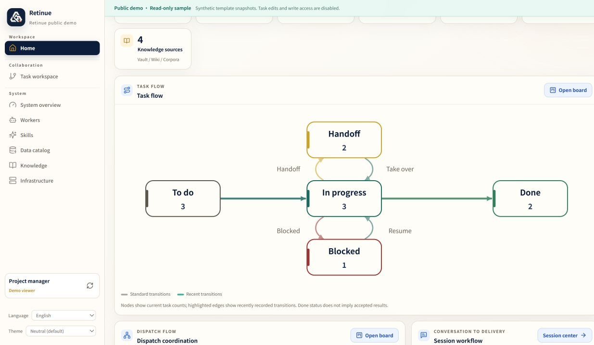
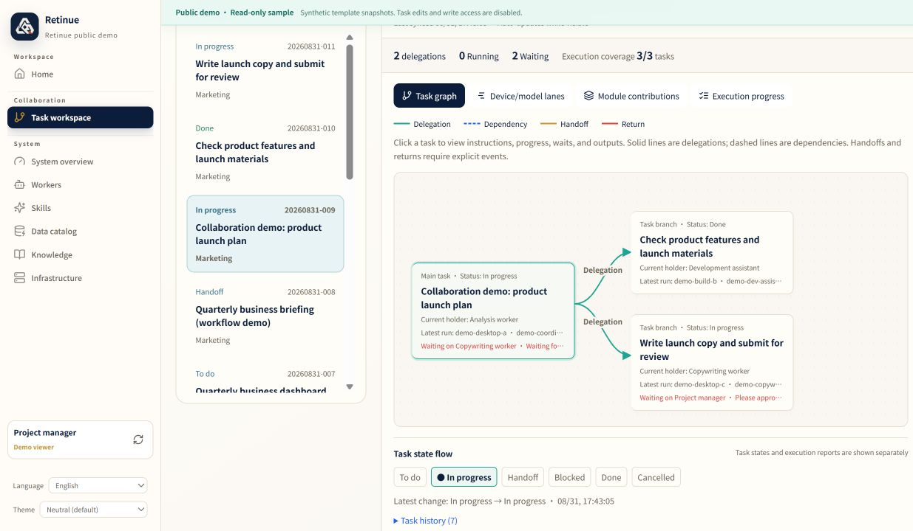

# Retinue (众卿) — self-hosted task board for humans and AI agents

[](LICENSE)
[](pyproject.toml)
[](docs/agent-onboarding.md)
[](SELF_HOSTING.md)

**English** · [简体中文](README.zh-CN.md) · [English demo](https://jklthinking.github.io/retinue/demo-en/?lang=en) · [中文演示](https://jklthinking.github.io/retinue/demo/?lang=zh-CN)

The dashboard now switches between English and 简体中文. The language preference
is saved locally and preserves the selected task/page. User-authored task content
is retained. See the [English PRD](docs/PRD.en.md), [English screenshots and release
notes](docs/releases/2026-10-03-english-edition.md), and [English sharing draft](docs/sharing/english.md).

**Retinue** (Chinese name **众卿**, "the assembled ministers") is a
self-hosted task board and orchestration hub where a mixed team of people and
AI agents work the same cards. Every piece of work is one durable baton: a
task card with a single holder, an acceptance check, and an append-only
receipt chain. You run the board, agents claim work over MCP or HTTP, they
write back, and you accept the card or send it back. There is no hosted
control plane, no vendor account requirement, and no telemetry. The server-backed
hub uses operator-managed local accounts and scoped credentials.

## 2026-10-03 English edition: visible collaboration

Version `0.3.0a1` brings the collaboration process into each task. See who
delegated to whom, what each device/model worker reported, what it is waiting
for, and which artifact supports the next handoff.

| View | What it explains |
|---|---|
| Home | The original task flow, dispatch coordination, and session flow views |
| Per-task graph | Explicit delegation, dependencies, baton movements, and review returns |
| Device/model timeline | Recorded runs with identity snapshots and source labels |
| Module contributions | Explicit functional assignments, reported work, remaining items, and artifact references |
| Node details and context | Instructions, acceptance criteria, waiting owners, progress, evidence versions, and next-step intent |
| Operations and data quality | Separate sources, reported usage coverage, receipt freshness, and retained history |

Read-only cc-connect observers match native sessions to Claude records and
deduplicate usage by stable deliveries. A worker is an execution identity;
session transports and observers are listed separately. The operations view
has one primary implementation, while the existing task and session modes
remain available.

**Boundaries:** delegation does not launch a model, observation does not invent
task progress, an executor's claim is not independent acceptance, and reported
usage is not a complete provider bill. Explicit task bindings and structured
receipts are needed to follow real work. GitHub retains code/PR/CI evidence;
Retinue retains holder, lease, task state, and collaboration events.

All screenshots below use the deterministic, read-only **synthetic demo**
(`seed=42`).
Its product-launch example illustrates the UI and protocol, not real model
execution or an end-to-end production acceptance result. Collaboration images
show one fixed task; timestamps come from staged synthetic demo time, not
production activity.





[Operations screenshot](docs/images/2026-10-03-en/03-operations.jpg) ·
[Data-quality screenshot](docs/images/2026-10-03-en/04-data-quality.jpg) ·
[Device/model lanes](docs/images/2026-10-03-en/05-worker-lanes.jpg) ·
[Module contributions](docs/images/2026-10-03-en/06-module-contributions.jpg) ·
[Branch details](docs/images/2026-10-03-en/07-branch-detail.jpg) ·
[Home dispatch and session flow](docs/images/2026-10-03-en/08-home-dispatch.jpg) ·
[Full update notes](docs/releases/2026-10-03-english-edition.md) ·
[English PRD](docs/PRD.en.md) · [Sharing draft](docs/sharing/english.md)

## What is Retinue?

Retinue is a **self-hosted, local-first task board for AI agents and the
people who supervise them**. It is not a chat wrapper and not an agent
framework — it is the shared board and audit layer that sits underneath
whatever agents you already run (Claude Code, OpenAI Codex, any MCP client,
or a human with a browser).

- **One holder per card.** Work is never ambiguous: exactly one actor holds
  the baton, and only the holder can write. Another agent's token gets
  `403 holder-only-writes`.
- **Append-only receipt chain.** Claim, progress, hand-off, block, and
  acceptance are all recorded and cannot be rewritten after the fact.
- **Acceptance checks on the card.** A card says what "done" means before an
  agent starts. Recorded completion and independent quality verification
  remain separate observations.
- **MCP-native coordination.** `retinue-server mcp` exposes the board to any
  MCP-capable agent; there is also a plain HTTP + bearer-token API.
- **Runtime exporters.** Read-only importers for Claude Code and Codex
  session data give you token activity per agent without touching sources.
- **Optional IM adapters.** Lark/Feishu and Telegram bridges turn a chat
  message into an intent — never directly into a command.
- **Data sovereignty.** File mode keeps canonical state in one data directory
  (`org.yaml`, `tasks/`, `metrics/`, `nodes/`); stop writers before copying it.
  The server stores canonical state in `retinue.db`; use a consistent SQLite
  snapshot for its backup. Runtime source records, external artifacts,
  credentials and deployment configuration have separate recovery paths.
  See the [backup guide](SELF_HOSTING.md#backup).

## Who it is for

Individuals and small teams running a **fleet of AI coding agents** who want
one durable board, observable receipts, and data they can take away — without
adopting a hosted agent platform. It runs on one machine, a homelab box, or a
NAS.

## How Retinue differs

| | Retinue | Trello / Jira / Linear | Agent frameworks (LangGraph, CrewAI, AutoGen) |
|---|---|---|---|
| Primary users | People **and** AI agents on the same cards | People | Agents, in code |
| Where it runs | Your machine, self-hosted | Vendor SaaS | Inside your app process |
| Audit | Append-only receipt chain per card | Activity log, editable | Traces, usually ephemeral |
| Agent access | MCP server + token-scoped HTTP API | Bots and webhooks bolted on | N/A — it *is* the agent |
| Write safety | Holder-only writes, hooks only from `org.yaml` | Anyone with access | Whatever you code |
| Telemetry | None | Vendor-side | Varies |

Retinue does not replace your agent runtime. It replaces the spreadsheet,
the chat thread, and the "which agent is doing what right now?" question.

## Ten-minute corridor

The path below stays on loopback. Credentials stay in the environment, never
in a card.

### 1. Start the hub with Compose

Host port 9219 must be free (`docker compose` fails with "address already
in use" otherwise). The admin password must be at least eight characters.

```bash
read -rsp 'Choose an admin password (at least 8 characters): ' RETINUE_ADMIN_PASSWORD
printf '\n'
export RETINUE_ADMIN_PASSWORD
docker compose up --build
```

Wait until the logs show the hub listening, then:

```bash
curl -fsS http://127.0.0.1:9219/api/health
```

That returns JSON like `{"status":"ok","version":"0.3.0a1"}` with no
authentication. `version` is the PEP 440 string from `pyproject.toml` (the
same spelling as the wheel name and the next git tag, `v0.3.0a1`). Open
<http://127.0.0.1:9219/> and sign in as `operator` with that password. The
image is the authenticated v0.2 hub, not the old read-only panel.

### 2. Open a card

Onboard the agent first: sidebar **Administration** → prepare an executor with actor
id `worker-1`, save the one-time token outside the data volume. Then open
**Task workspace** → **Task board** → **New task** and publish:

- Title: `Write hello.txt with: hello from retinue`
- Holder: `worker-1` (the agent that will claim it; do not leave this as
  yourself if you will use the agent token in the next step)
- Priority: `high`
- Acceptance: `hello.txt contains exactly: hello from retinue`

Copy the generated task id (`task-YYYYMMDD-NNN`).

The same card can be published over HTTP after you sign in (session cookie)
or with an admin bearer. The holder must be `worker-1`.

### 3. Agent claim

Use the one-time token from step 2:

```bash
export RETINUE_AGENT_TOKEN='<one-time-agent-token>'
export RETINUE_TASK_ID='<task-id-from-the-board>'

curl --fail --request POST \
  --header "Authorization: Bearer $RETINUE_AGENT_TOKEN" \
  --header 'Content-Type: application/json' \
  --data '{"status":"doing","note":"claimed through the agent API"}' \
  "http://127.0.0.1:9219/api/tasks/$RETINUE_TASK_ID/update"
```

MCP-capable agents can use `retinue-server mcp` after
`pip install 'retinue[mcp]'` instead of learning curl. See
[`docs/agent-onboarding.md`](docs/agent-onboarding.md).

### 4. Write back

```bash
curl --fail --request POST \
  --header "Authorization: Bearer $RETINUE_AGENT_TOKEN" \
  --header 'Content-Type: application/json' \
  --data '{"progress":80,"refs":["artifact:hello.txt"],"note":"recorded the result reference"}' \
  "http://127.0.0.1:9219/api/tasks/$RETINUE_TASK_ID/update"
```

### 5. Acceptance

When the acceptance line is actually true:

```bash
curl --fail --request POST \
  --header "Authorization: Bearer $RETINUE_AGENT_TOKEN" \
  --header 'Content-Type: application/json' \
  --data '{"status":"done","note":"acceptance checked; hello.txt matches"}' \
  "http://127.0.0.1:9219/api/tasks/$RETINUE_TASK_ID/update"
```

Refresh the board. The card is in `done` and the chain shows claim, write-back,
and completion. A token issued for a different agent receives
`403 holder-only-writes`.

A file-mode corridor (no Docker) is in
[`docs/closed-loop-walkthrough.md`](docs/closed-loop-walkthrough.md).
Installation, backup, and exposure warnings are in
[`SELF_HOSTING.md`](SELF_HOSTING.md).

## Architecture (one page)

```text
 operator                         agents
    |                                |
    |  org.yaml (hooks only)         |  MCP or HTTP + actor token
    v                                v
 +------------------------------------------------------+
 |                    RETINUE hub                       |
 |  task cards  -- holder, acceptance, append-only chain |
 |  claim / update / receipt / handoff / block          |
 |  optional IM adapter (intent in, never a command)    |
 +------------------------+-----------------------------+
                          |
          +---------------+----------------+
          |                                |
   read-only board                  node reports
   127.0.0.1 panel                  heartbeat + CLI inventory
   GET only                         node token, no card writes
```

File mode keeps canonical state in the selected data directory; stop writers
before copying it. Server mode uses `retinue.db` and needs a consistent SQLite
snapshot. Runtime source records, external artifacts, credentials and deployment
configuration are recovered separately; see [Backup](SELF_HOSTING.md#backup).
Agents never choose `on_claim` hooks; file-mode hooks come only from `org.yaml`.


## FAQ

**What is Retinue used for?**
Assigning work to a mix of humans and AI agents on one self-hosted board, and
keeping a verifiable record of who held each card, what they claimed, and
whether the acceptance check actually passed.

**Does Retinue work with Claude Code, Codex, or other MCP clients?**
Yes. MCP-capable agents connect through `retinue-server mcp`. Agents without
MCP use the HTTP API with a scoped actor token. Claude Code and Codex also
have read-only session exporters for token activity.

**Is Retinue open source?**
Retinue is open source under the MIT License. Personal and commercial use,
modification, and redistribution are permitted with the copyright and permission
notice preserved. See [LICENSE](LICENSE).

**Does Retinue send my data anywhere?**
No. There is no telemetry, no hosted control plane, no remote account, and no
mandatory outbound request. The core, panel, daemon, demo, and exporters all
work offline. Only IM adapters you explicitly configure contact anything.

**Can I self-host Retinue on a homelab or NAS?**
Yes. `docker compose up --build` brings up the hub on one host port; the
loopback corridor below is the ten-minute path. See
[`SELF_HOSTING.md`](SELF_HOSTING.md) for exposure warnings and backup.

**How is Retinue different from an AI kanban board like Vibe Kanban?**
Retinue is board *plus* audit boundary. Agents are treated as untrusted
executors: they can never choose the hook that runs, only the operator's
`org.yaml` can; writes are holder-only; and the receipt chain is append-only.
The board is the governance surface, not just a task queue.

**Does Retinue require Docker?**
No. There is a file-mode corridor with no Docker in
[`docs/closed-loop-walkthrough.md`](docs/closed-loop-walkthrough.md).


## License

RETINUE’s own source code in this release is licensed under **MIT** (SPDX: MIT).
Personal and commercial use, modification, distribution, and sublicensing are
permitted; preserve the copyright and permission notice. See [LICENSE](LICENSE)
and [NOTICE](NOTICE). Third-party dependencies retain their own licenses; the
frontend distribution’s complete copyright and permission texts are preserved
in [THIRD_PARTY_NOTICES](docs/THIRD_PARTY_NOTICES.md).

Historical releases retain the license published with them; historical tags
are not rewritten. RETINUE and 众卿 marks remain with JKL Thinking. Forks and
third-party services must not represent themselves as official RETINUE.

---

## Community

RETINUE is announced and discussed on the [LINUX DO](https://linux.do) community.
Issues and pull requests are welcome on GitHub.
