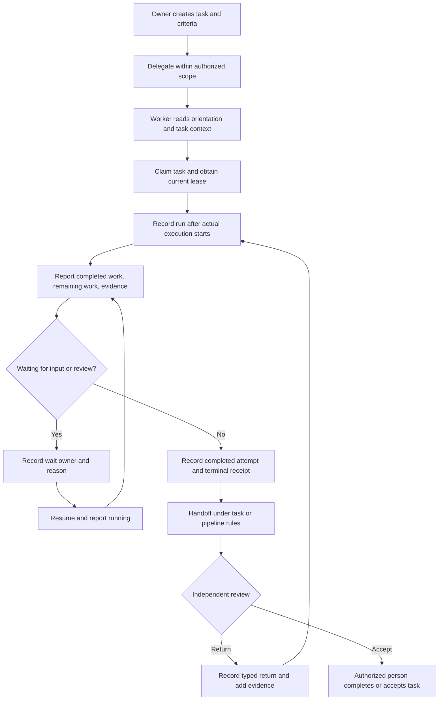

# Retinue product requirements

[简体中文](PRD.md) · **English** · [English demo](https://jklthinking.github.io/retinue/demo-en/?lang=en)

Edition: 2026-10-03 English edition of the community update. Software version: `0.3.0a1`. Retinue's own code is MIT licensed.

This document describes current behavior and proposed next steps. **Implemented** means the capability exists in this codebase; it does not mean every deployment is configured or every real-model scenario has passed acceptance. Public examples and screenshots use synthetic data.

## 1. Product position

Retinue is a local coordination and observability tool for heterogeneous AI workers. It brings delegation, device/model identity, execution receipts, waiting, handoffs, and artifact evidence into one task workspace. Users should be able to answer: **Who asked whom to do what? What has been reported? Who is waiting for whom? Who continues next?**

A worker has an explicit device, runtime, and model identity. Tasks and sessions record its work; opening several sessions does not create several workers. Session synchronizers and collectors are transport or observation services, shown separately and excluded from execution-worker counts.

## 2. Problems

With several models working at once, chats, terminals, and repositories each hold part of the context. An online model does not identify its task. A reply saying “done” does not establish delivery or acceptance. A usage total does not explain which sources were connected.

This update addresses four problems:

1. Delegation, waiting, review returns, and handoffs are difficult to follow within one task.
2. Devices, runtimes, models, sessions, and sync services are mixed together, obscuring attribution.
3. Task events, runtime usage, and cumulative session counts are confused; missing or stale reports may appear normal or zero.
4. Duplicate entrances obscure both page purposes and contributions to a task's functional modules.

## 3. Goals and evidence

| Goal | User action | Acceptance evidence |
|---|---|---|
| Understand collaboration | Identify delegators, delegates, dependencies, returns, and handoffs in a task graph | Every edge has an explicit event or declared dependency |
| Identify contributors | Select an execution in device/model lanes | Identity snapshot, status, time, and reporting source are visible |
| Understand module contributions | Inspect owners, reported work, remaining work, and artifact references by module | Group only explicit `module` labels; missing labels remain unassigned |
| Continue a task | Read context and identify criteria and the next step | Read-only context separates state records, unverified claims, and evidence versions |
| Explain operational numbers | Trace source, scope, timezone, and report time | Missing data stays unknown; observed coverage does not imply completeness |
| Reduce duplicate entrances | Enter the appropriate task or system mode | Existing features remain reachable; operations has one main implementation |

Success means traceable evidence, visible unknowns, and reproducible legal workflows. Online time, completion labels, and token consumption are not quality scores.

## 4. Users

| User | Need | Main entrance |
|---|---|---|
| Project owner | Delegate, inspect relationships, resolve waits, accept independently | Home, task workspace, workroom |
| Execution worker | Claim its task, report work, provide artifacts, hand over | MCP, task context, structured receipts |
| Operator | Register identities, inspect sources, locate stale data | Workers, infrastructure, data catalog, operations |
| Read-only collaborator | Understand permitted progress and evidence | Collaboration graph, progress overview, system overview |

Server rules determine permissions. A visible page or control does not grant authority.

## 5. Scope

### Implemented

- The original three home visualizations: task flow, dispatch coordination, and session flow.
- Per-task relationship graphs, device/model timelines, module contributions, and task-state history.
- Clickable task or execution nodes exposing instructions, criteria, progress, waiting, artifacts, and next steps.
- Explicit delegation creates a child task with its own holder, state, lease, and attempts.
- Structured running, waiting, and terminal receipts, plus explicit pipeline returns and handoffs.
- Execution-start snapshots preserve device, runtime, model, and provenance despite later registry changes.
- Organization orientation and task context for new sessions, excluding private chat content.
- Read-only cc-connect native session observation and Claude usage collection: native-session matching, actual message-model attribution, stable delivery deduplication.
- Separate task-event throughput, reported runtime usage, and optional Hermes session projections.
- Explicit coverage, freshness, source times, retained history, and missing identity fields.
- One operations mode within the system overview, with existing features preserved.
- A read-only synthetic static demo; MIT for Retinue's own code and retained third-party notices.
- Switchable Chinese/English interface. System copy follows the selected language; live user-authored task content is retained. A separate English demo uses English synthetic fixtures.

### Current limits

- Queuing delegation does not automatically launch arbitrary runtimes. Optional execution adapters enforce single-use permissions and leases; directly started CLIs are outside their control.
- Observing a native session does not automatically produce task progress. Task binding is explicit and progress requires structured receipts.
- Registered or reported models carry provenance; they are not vendor-certified identity proof.
- A successful execution receipt is distinct from task completion, and a `done` task record is distinct from independent acceptance.
- Token reports cover connected sources. Missing sources remain unknown. There is no complete provider-billing guarantee or automatic task-cost allocation.
- Artifact references and revisions locate evidence; external contents are not automatically fetched and verified.
- System installation, such as Windows scheduled tasks, may require operating-system administrator approval.
- Synthetic demonstrations exercise interface and protocol behavior; real-model acceptance remains a separate checklist.
- Switching language does not machine-translate user-entered instructions, transcripts, artifact contents, or model identities.

## 6. Page purposes and navigation

These are **Retinue pages**, distinct from a task's functional modules in section 8.

| Entrance / mode | Purpose | Retained operations or views | Main data |
|---|---|---|---|
| Home | Find active work and items requiring attention | Task flow, dispatch, session flow | Tasks, members, session records |
| My affairs / agenda | Organize personal items and waits | Quick capture, parent/child items, progress | Personal todos, proposals, schedule |
| Task workspace / collaboration | Follow the selected task | Graph, lanes, modules, details, context | Events, runs, attempts |
| Task workspace / board | Manage tasks by state | Create, drag through legal transitions, ready filter | Current cards and legal states |
| Task workspace / list | Search tasks and archives | State/holder filters, complete history | Tasks and archive flags |
| Task workspace / workroom | Dispatch work and inspect receipts | Dispatch, dialogue, recommendations, workspace links | Intent, capabilities, evidence |
| Task workspace / progress overview | Summarize queued, active, blocked, and approval work | In-hand work by model | Task state and approvals |
| Session center / history | Search sessions and task links | Authorized content, convert to task | Runtime session index |
| Session center / live | Observe real execution endpoints | Controlled operations within existing permissions | Probes and explicit endpoint bindings |
| System overview / health | Inspect devices, models, skills, and services | Global health and source state | Nodes, runtimes, registry |
| System overview / operations | Review throughput and reported usage | 1/7/30 days, source sections, refresh explanations | Event chains, daily reports, optional snapshots |
| Workers | Register device/runtime/model and capabilities | Execution workers separated from sync services | Actor registry and identity completeness |
| Skills | Inspect available capabilities | Scope, source, description | Skill catalog |
| Data catalog | Explain storage and operational data health | Data layers, quality checks, formats, boundaries | Sources and health checks |
| Knowledge | Inspect referenceable knowledge | Catalog and provenance | Knowledge records |
| Infrastructure | Locate reachability/environment problems | Devices, resources, runtime state | Authorized node reports |
| Optional hub | Retain deployment-specific console | Existing modules and operations shortcut | Optional deployment projection |
| Administration | Maintain accounts, permissions, and configuration | Admission, credentials, permissions | Operator control surface |

Duplicate views become modes or shortcuts. Distinct task boards, historical sessions, live endpoints, and usage statistics retain their purposes. Existing URLs and browser navigation remain usable.

## 7. Per-task collaboration view

### Relationship graph

Nodes represent root tasks, children, or direct external dependencies. Edges distinguish delegation, dependency, handoff, and review return. Delegation derives from matching explicit records on both sides. Returns derive from typed pipeline receipts, never guessed from free text.

Nodes show the title, task state, holder, latest execution identity/status, and explicit wait owner/reason. Tasks without runs show recorded task-state history and “No execution report yet.”

### Device/model lanes

Lanes distinguish actor, device, model, and runtime. Bars represent execution records and their recorded start/end times. Collection time does not become model working time. Missing identities or times are explained; spans are not invented.

A prepared run displays “Awaiting start.” An active record with an expired lease requires verification rather than implying ongoing execution. Ended runs remain historical observations.

### Node details

| Group | Contents | Interpretation |
|---|---|---|
| Instructions | Delegator, delegate, instruction, acceptance | Instructions are data, not executable installation commands |
| Identity | Device, runtime, registered/reported model, source | Missing fields stay unknown; new registry values do not replace history |
| Progress | Counts, reported completed work, remaining work | Worker claims, distinct from task percentage and acceptance |
| Waiting | `kind`, `owner`, `reason`, `since` | Requires a specific owner and reason |
| Artifacts | Safe refs, immutable revision, matching attempt | A reference does not prove verified content |
| Next step | `next_action`, `next_owner` | Handoff intent; neither changes holder nor grants authority |
| History | Delegation, state, handoff, return, execution receipts | Event sequence/cursors govern history; timestamps do not reconstruct missing events |

## 8. Functional modules within each task

Delegations, runs, or completed-work items explicitly record module labels. Titles, departments, and keywords do not automatically determine modules.

The fixed-seed public demo follows **“Collaboration demo: product launch plan”**:

| Module | Synthetic contributor | Work | Artifacts and waiting |
|---|---|---|---|
| Launch coordination | demo-desktop-a · analyst · Codex runtime | Split feature checks and copy branches; assemble results | Check results received; waiting for copy review |
| Feature checks | demo-build-b · dev-assist · Claude Code runtime | Check three features and provide a checklist | Synthetic terminal receipt and artifact reference |
| Launch copy | demo-desktop-c · copywriter · Codex runtime | Hero headline and feature descriptions | Waiting for project manager tone/wording approval |

Model fields use explicit `demo-*` values. These records do not establish real model execution or root-task completion. Graph, lanes, modules, and branch details follow the same task. Stage times come from a deterministic demo clock, not production activity.

Every module exposes tasks/runs, responsible identities, work claims, remaining items, waits, artifacts, and verification state. Unlabelled records remain unassigned. Unreviewed contributions remain unverified. Selection is shared across the graph, lanes, and module view.

## 9. User flows

### Delegation through handoff

Identity, lease, and idempotency validation apply to each request. Retry preparation creates a new lease for a specified blocked branch; it does not start a model or alter successful siblings.

### Continuing in a new session

A new worker reads organization orientation, then its held task's context and criteria. It sees explicit `done` records, unverified work claims, evidence revisions, failed attempts, waits, and next steps. Authority still comes from holder and current lease, not `next_owner` in context.

### Checking sources

Operators trace usage coverage into data quality checks for missing identity fields, duplicate candidates, stale collection, lease anomalies, and historical sources. Identity merges require device/runtime/model and credential-use review. History is not deleted to make a check appear healthy.

## 10. Identity and data authority

| Layer | Records | Authority | Does not replace |
|---|---|---|---|
| Actor / worker | Device, runtime, model, capabilities, enabled state | Registered execution identity | Vendor-certified actual model proof |
| Task | Goal, criteria, holder, state, lease, dependencies | Retinue task state | Code or external acceptance results |
| TaskEvent | Explicit transitions, delegation, pipeline moves, run receipts | Append-only collaboration history | Private chat content |
| Run | Reported execution, identity snapshot, waiting, work claims | Structured worker/operator observations | Automatic acceptance |
| Attempt | Execution start/end and outcome | Separate append-only execution evidence | Task-field write permission |
| Runtime session | Metadata and optionally authorized content | Native observation and explicit task binding | Collaboration inferred from chat |
| Usage | Source daily reports, scope, input/output | Reported usage | Complete bills or task cost |
| GitHub / external artifacts | Code, commits, PRs, issues, CI | External artifact and version | Retinue holder, leases, handoffs |

GitHub stores code, review, and test evidence. Retinue stores structured task state and collaboration events. References should identify immutable commits or digests. Arbitrary bidirectional editing of the same task state is not currently supported; future integration needs explicit field ownership and conflict rules.

## 11. API contracts

These endpoints exist in the current server. Identity, visibility, holder, lease, and channel rules still apply. See the [collaboration protocol](protocol/collaboration.md).

| API | Purpose | Constraint |
|---|---|---|
| `GET /api/tasks/{id}/collaboration` | Tree, delegations, runs, events, attempts, modules, capabilities | Read-only projection; no sweep or mutation |
| `GET /api/tasks/{id}/collaboration/events` | Incremental event/attempt cursors | Advance each cursor after successful consumption |
| `GET /api/tasks/{id}/context` | Bounded context for a new session | No private session content or summaries |
| `POST /api/tasks/{id}/delegations` | Create child and parent delegation event | Cross-actor scope requires operator authorization |
| `POST /api/tasks/{id}/runs` | Create started/prepared run | At most one active run per task lease |
| `POST /api/tasks/{id}/runs/{run_id}/events` | Progress, waiting, outcome receipts | Terminal outcome requires matching completed attempt |
| `POST /api/tasks/{id}/runs/{run_id}/authorize-execution` | Single-use optional adapter permission | Unknown outcome cannot trigger an automatic restart |
| `POST /api/tasks/{id}/collaboration/retry` | Prepare a branch retry | No launch, process kill, or successful-sibling changes |
| `POST /api/tasks/{root_id}/collaboration/policy` | Operator-maintained delegation scope | Root scope with bounded depth/count |
| `GET /api/orientation/context` | Organization/capability orientation | Does not grant execution permission |
| `POST /api/sessions/sync` | Source session-index sync | Idempotent cursors and content-conflict checks |
| `POST /api/metrics/ingest` | Report daily runtime usage | Actors report as themselves |
| `GET /api/metrics/summary` | Usage, source times, coverage | Does not infer unrecorded consumption |
| `GET /api/metrics/throughput` | Task-event throughput | Distinct from accepted-deliverable counts |
| `GET /api/data-catalog` | Structure, boundaries, health | Read-only; no history deletion |

Collaboration writes use `idempotency_key` and optional `lease_term`. Unknown fields are rejected. Exact replays create no duplicate events; a changed payload with the same key conflicts.

Execution receipts contain:

- `status`: `running`, `waiting`, `succeeded`, `failed`, or `cancelled`.
- `progress`: `completed`, `total`, `unit`; omit an unknown denominator.
- `waiting`: `kind`, registered `owner`, and `reason`, required for waiting.
- `progress_report`: `completed[]`, `remaining[]`, `next_action`, `next_owner`.
- Completed work: `summary`, safe `refs[]`, immutable `revision`, optional `module`.
- `attempt_id`: completed evidence matching task, actor, lease, and outcome.

`progress_reported_at`, `last_report_at`, and lease `heartbeat_at` distinguish progress, any receipt, and lease heartbeat. Explicit progress older than 15 minutes prompts verification; it does not fail a task automatically.

## 12. Tokens and source freshness

### Separate sources

Task throughput derives from TaskEvent, runtime usage from daily reports, and optional Hermes sections from separate snapshots. They are not added into one “total consumption.”

| Source | Input/output accounting | Deduplication/time rule |
|---|---|---|
| Claude Code | Input = input + cache creation + cache read; output separate | Session + message-delivery deduplication; repeated reports merge component maxima |
| Codex | Input already contains cached-input subset; output separate | Do not add cached input again; follow cumulative snapshot differences and replay deduplication |
| Other runtime reports | Preserve reported input/output | Unknown cache breakdown is unavailable |
| Hermes session projection | Recorded cumulative values with coverage | Assigned to session start date, not actual token-consumption date |

The 1/7/30-day views share timezone and day-boundary rules and show their date windows. Historical records with missing timezone remain unknown. Invalid/future dates are excluded from current charts; history remains stored.

### Explain freshness

Reading a page every minute does not refresh its collectors. Receipt time, last underlying activity, progress reports, and lease heartbeats are separate.

A successful collection proves which records were checked, not that a worker is reasoning now. Workers without reports remain unknown. Daily-report coverage does not guarantee every provider, message, or session is counted. Reports older than 30 minutes are flagged stale; operators configure collector schedules.

### cc-connect boundary

The collector reads native session indexes and matching Claude records only. It retains allowlisted metadata and usage, excluding message bodies, tool content, and IM secrets. Actual message models determine historical breakdowns; current configuration does not overwrite older model usage.

Missing sources, read failures, attribution gaps, and model conflicts affect coverage. A readable remainder does not establish complete usage. Without explicit task binding the collector writes no task progress, and receives no delegation, launch, or worker impersonation authority.

## 13. Security and public publication

| Surface | Requirement |
|---|---|
| Repository | No credentials, production databases, private accounts, machine paths, deployment addresses, transcripts, or real task content |
| Demo | Deterministic synthetic actors/tasks/usage; read-only |
| Screenshots | Direct captures of synthetic UI; no claim of real-model acceptance |
| Collection | Source read-only; never write into transcripts; atomic destination updates |
| Execution config | Commands come only from operator-controlled configuration |
| Task writes | Current holder, legal state, matching lease, append-only history |
| Transport services | Excluded from execution workers; no new execution permissions |
| License | MIT for Retinue code; dependency/asset notices retained |

The community source originated as a sanitized snapshot. Public updates preserve that boundary. Removing sensitive files from a working tree would not clean old Git history. Review the complete snapshot, generated data, images, and license consistency before publication.

For recovery, file mode needs a consistent backup of the whole coordination data directory after stopping writers. Server mode needs a consistent SQLite `retinue.db` backup. Runtime files, artifact stores, credentials, and deployment configuration need separate recovery planning; `org.yaml` alone is not a server backup. See [self-hosting](../SELF_HOSTING.md).

## 14. Acceptance checklist

| ID | Scenario | Pass condition |
|---|---|---|
| A01 | Home restored | All three original visualizations are visible and usable |
| A02 | Same-task delegation | Explicit child and edge; delegate cannot overwrite parent holder |
| A03 | Actual start | Queued, prepared, and started remain distinct; chats do not fabricate runs |
| A04 | Parallel work | Separate child cards with device/runtime/model provenance |
| A05 | Waiting/resume | Named owner/reason; resumed running report; history retained |
| A06 | Terminal reporting | Matching attempt; receipt does not directly complete task |
| A07 | Review return | Typed return distinct from handoff/dependency |
| A08 | Handoff context | Criteria, claims, revisions, next step; no private transcripts |
| A09 | Modules | Explicit grouping; unassigned missing labels; unverified claims remain marked |
| A10 | Historical identity | Registry changes do not rewrite run snapshots |
| A11 | Usage replay | No extra delivery usage or duplicate session rows |
| A12 | Unknown/stale | Missing stays unknown; stale flagged; page refresh does not refresh activity |
| A13 | Source separation | Task/runtime/session sections separate; cache not double-counted |
| A14 | Permissions/leases | Wrong holders, old leases, unknown launch outcomes cannot bypass controls |
| A15 | Navigation | Existing functions/URLs remain; duplicate operations share an implementation |
| A16 | Public materials | Synthetic, sanitized, accurately labelled, consistent licensing |
| A17 | Languages | Language switch retains task/page selection; user content is unchanged; English demo and documentation are readable |

`python scripts/demo_collaboration_flow.py` reproduces a synthetic protocol flow. Automated checks and real deployment acceptance are recorded separately. Unfinished scenarios are not marked passed.

## 15. Proposed next stages

These are proposals, not deployed-feature or delivery-date promises.

| Stage | Work | Completion definition |
|---|---|---|
| Current community update | Views, receipts, identity provenance, usage explanations, health, navigation, languages | Reproducible code/demo with explicit integration limits |
| P1: real execution loop | Controlled adapters, explicit session binding, automatic structured reports, installation checks | One real task completes delegation, start, wait, report, return, handoff with legal evidence |
| P1: source governance | Coverage inventory, collection diagnostics, identity review, lifecycle | Recoverable sources; reviewed identity merges preserve history |
| P1: GitHub evidence | Immutable commit/PR/CI references and read-side checks | Explicit authority/conflict rules; external state is not silently task acceptance |
| P2: quality/cost | Acceptance, rework, wait time, attributed usage | Calculate only with adequate coverage/binding; unknowns remain visible |
| P2: explainable alerts | Stalls, duplicate delegation, source problems | Traceable evidence; alerts do not expand execution authority |

Priorities: public material/license review, reproducible UI acceptance, one real execution loop, sustained collection, then external evidence and quality analysis. Complete visualizations do not imply complete execution evidence.

## 16. Implementation references

- [Security model](security.md), [collaboration protocol](protocol/collaboration.md), [task-state protocol](protocol/task-state.md).
- `webui/src/App.tsx`, `TaskFlowPage.tsx`, `TaskCollaborationVisual.tsx`, `TaskContextPanel.tsx`, `i18n/`.
- `server/routers/collaboration.py`, `server/collaboration_schemas.py`, `server/collaboration_context.py`.
- `server/routers/metrics.py`, `server/usage_accounting.py`, `server/data_health.py`.
- `adapters/collectors/cc_connect.py`, `adapters/exporters/claude_code.py`, `adapters/exporters/codex.py`.

Update implemented scope, limitations, and acceptance criteria in both language editions as behavior evolves.
