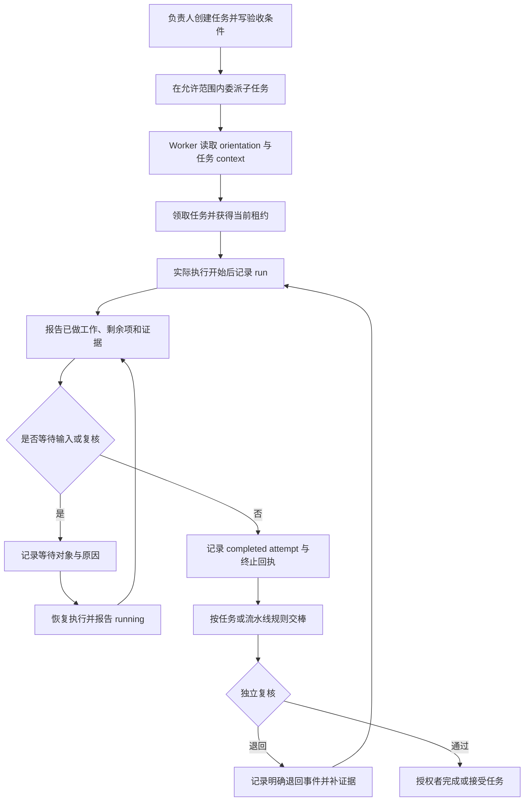

# Retinue 产品需求文档

**简体中文** · [English](PRD.en.md)

版本：2026-10-02 社区更新 · 软件版本 `0.3.0a1` · 自有代码 MIT

本文描述当前代码的产品行为和后续工作。标记“已实现”表示代码中存在对应能力，不代表任意部署已经配置完成，也不代表真实模型协作的全部场景均已通过验收。公开图片与示例采用合成数据，不含真实工作记录。

## 1. 产品定位

Retinue 是面向异构 AI Worker 的本地协调与观察工具。它把任务委派、设备与模型身份、执行回执、等待对象、接棒和成果证据放在同一个任务现场，让使用者能够回答：**谁让谁做了什么，现在做到哪里，卡在谁那里，接下来由谁继续。**

一个 Worker 对应一条明确的执行身份：设备、runtime、模型。任务和会话是这条身份参与工作的记录，不会因为一个 Worker 开了多个会话就自动变成多个成员。会话同步器和采集器属于运输或观察服务，单列展示，不纳入执行者人数。

## 2. 背景与问题

多模型同时工作时，聊天、终端和代码仓库各自保存部分上下文。用户容易看到“模型在线”，却不知道它正在做哪项任务；看到回复“完成”，却无法判断是否有成果和验收；看到用量总数，却不清楚哪些来源已经接通。

本次更新聚焦四个问题：

1. 每项任务缺少直观的委派、等待、退回和接棒过程。
2. 设备、runtime、模型、会话和同步服务混在一起，贡献归属难以解释。
3. 任务事件、runtime 用量和会话累计统计被混读，未上报或过期数据容易被看作零或正常。
4. 同一功能存在多个入口，页面目的和任务功能模块的贡献不够清楚。

## 3. 目标与衡量方式

| 目标 | 使用者应能完成的动作 | 验收依据 |
|---|---|---|
| 看清同任务协作 | 从任务关系图识别发起者、被委派者、依赖、接棒和退回 | 每条关系都有明确事件或声明的依赖依据 |
| 看清谁在做事 | 在设备/模型泳道中选择一次执行 | 查看身份快照、状态、时间与上报来源 |
| 看清模块贡献 | 按任务功能模块查看负责人、已报工作、剩余项和成果引用 | 仅对显式 module 标签分组，历史缺项保持未分配 |
| 能继续接棒 | 新 Worker 读取任务上下文后知道验收条件和下一步 | 只读 context 区分状态记录、未核验声明和证据版本 |
| 能解释运营数字 | 从统计值追溯来源、范围、时区和上报时间 | 未上报为未知；观察覆盖不宣称底层完整 |
| 减少重复入口 | 从任务工作台和系统总览进入相应模式 | 旧功能仍可达，运营页面只有一个主实现 |

成功标准以证据可追溯、未知情况可见、合法协作流程可复现为主。当前不以模型在线时长、任务完成标签或 Token 消耗大小作为成果质量评分。

## 4. 目标用户

| 用户 | 需求 | 主要入口 |
|---|---|---|
| 项目负责人 | 派单、看任务关系、处理等待、独立验收 | 首页、任务工作台、协作空间 |
| 执行 Worker | 领取自己的任务、报告进展、给出成果、交给下一棒 | MCP、任务上下文、结构化回执 |
| 运维人员 | 登记设备与模型、检查采集源、定位过期数据 | 智能体、基础设施、数据整理、运营效率 |
| 只读协作者 | 了解允许查看的任务进展和证据 | 协作图、进度概览、系统总览 |

权限以服务端规则为准；页面显示能力不构成授权。

## 5. 当前范围

### 5.1 已实现

- 保留首页的任务流转、派单协调、会话流转台三项可视化。
- 每项任务有协作关系图、设备/模型时间泳道、模块贡献和任务状态历史。
- 点击任务或执行节点查看指令、验收条件、进展、等待对象、成果引用及下一步。
- 显式委派创建子任务；子任务拥有独立 holder、状态、租约和 attempts。
- 结构化执行回执，含 running、waiting 和终止结果；支持显式流水线退回与接棒。
- 执行开始时冻结设备、runtime、模型及其来源，避免登记变动改写历史归属。
- 新会话可读取组织 orientation 和任务 context；私有聊天正文不进入共享上下文包。
- cc-connect 原生会话观察与 Claude 用量采集；按原生会话选择来源，以实际消息模型分层，以稳定 delivery 标识去重。
- 运营看板分别呈现任务事件、已上报 runtime 用量、可选 Hermes 会话累计投影。
- 用量覆盖、新鲜度、来源时间、历史来源保留和身份缺项有明确说明。
- 重复运营入口统一到系统总览的运营效率模式；已有页面功能保留。
- 公开静态演示只读，使用合成数据；自有代码使用 MIT，第三方声明保留。

### 5.2 当前限制

- 委派排队不会自动启动任意 runtime。可选执行适配器遵循单次权限和租约，直接启动 CLI 的行为不受该适配器控制。
- 原生会话被观察到，不等于其内容已自动转成任务进度。任务关联需显式绑定，进度需结构化回执。
- 模型由登记或执行者上报；来源会标注，不能视为供应商认证。
- 一条执行成功回执不等于任务完成，一条任务 done 记录不等于独立质量验收。
- Token 数据是已接通来源的报告。缺失来源显示未知，当前没有全供应商账单保证，也没有自动按任务分摊。
- 成果引用和 revision 保存证据位置与版本；当前不会自动拉取并验证外部文件内容。
- Windows 定时任务等系统安装步骤可能需要操作系统管理员确认。
- 合成演示展示交互与协议，不证明真实模型执行；真实试点仍需按完整验收清单复核。

## 6. 页面用途与入口

这里的“页面模块”是 Retinue 功能入口，与第 8 节的“任务功能模块”分开解释。

| 主入口 / 模式 | 用途 | 保留的操作或视图 | 主要数据 |
|---|---|---|---|
| 首页 | 找到正在推进和需要处理的工作 | 任务流转、派单协调、会话流转台 | 任务、成员、会话记录 |
| 我的事务 / 日程 | 安排个人事项和等待 | 快捷记录、父子事务、进度设置 | 个人待办、提案、日程 |
| 任务工作台 / 协作图 | 观察选中任务的全过程 | 关系图、泳道、模块、节点详情、上下文 | 协作事件、runs、attempts |
| 任务工作台 / 任务看板 | 按状态管理任务 | 新建、拖拽流转、现在可做筛选 | 当前任务卡和合法状态 |
| 任务工作台 / 任务列表 | 搜索全部任务及归档 | 状态、负责人筛选、完整历史 | 任务列表与归档标记 |
| 任务工作台 / 协作空间 | 派发工作、查看推荐成员与回执 | 派发、对话、成果回执、跳转协作现场 | 意图、成员能力、任务证据 |
| 任务工作台 / 进度概览 | 汇总全局待接单、执行中、受阻、审批 | 按模型查看在手工作 | 任务状态与审批记录 |
| 会话中心 / 历史会话 | 检索会话、摘要和任务关联 | 查看已授权内容、转为任务 | Runtime 会话索引 |
| 会话中心 / 实时会话 | 观察真实运行端点 | 在已有权限内执行受控操作 | 节点探测及显式端点绑定 |
| 系统总览 / 系统健康 | 了解设备、模型、技能与服务 | 全局健康与来源状态 | 节点、runtime、登记信息 |
| 系统总览 / 运营效率 | 复盘任务吞吐和已报用量 | 1 / 7 / 30 天，来源分区、刷新说明 | 事件链、日报、可选观察快照 |
| 智能体 | 登记设备、runtime、模型和能力 | 执行者与同步服务分区 | Actor 登记与身份完整性 |
| 技能中心 | 了解可调用能力 | 来源、范围、说明 | 技能目录 |
| 数据整理 | 解释数据目录和运行数据健康 | 数据层、质量检查、格式与边界 | 来源、结构检查、健康检查 |
| 知识库 | 查看可引用的知识与来源 | 知识目录与来源 | 知识记录 |
| 基础设施 | 定位可达性和运行环境问题 | 设备、资源、runtime 状态 | 已准入节点的报告 |
| 可选中枢 | 保留部署相关控制台 | 原有站点模块、运营效率快捷入口 | 可选部署投影 |
| 管理 | 维护账号、权限和系统配置 | 准入、凭据管理、权限设置 | 操作员管理面 |

入口合并规则：重复的同一视图合并成模式或快捷入口；功能语义不同的任务看板、历史会话、实时端点和运营统计不合并为一页。旧 URL 和浏览器返回保持可用。

## 7. 任务协作主视图

### 7.1 关系图

节点表示主任务、子任务或直接外部依赖。边的类型分别为委派、依赖、交棒和审查退回。委派从双方匹配的明确记录投影；退回来自带类型的流水线回执，不从自由文本猜测。

每个节点显示标题、当前状态、当前 holder、最近执行身份与状态；等待时展示等待对象与理由。历史任务没有 run 时，显示已有状态历史和“尚无执行上报”。

### 7.2 设备/模型时间泳道

泳道按照 Actor、设备、模型、runtime 组合区分，条带对应执行记录。条带使用已记录开始与结束时间，不把采集时间画成模型工作时间。身份或时间缺失的历史记录单列说明，不虚构时间跨度。

待启动的 prepared run 必须显示“等待启动”；过期租约中的活跃记录需要核对，不继续表示正在执行。已结束 run 作为历史观察保留。

### 7.3 节点详情

| 信息组 | 展示内容 | 解释规则 |
|---|---|---|
| 任务指令 | 委派者、被委派者、instruction、acceptance | 指令是数据，不能安装执行命令 |
| 身份 | 设备、runtime、实际上报或登记模型、来源 | 缺项为未知；后续登记不覆盖历史 |
| 进展 | 数量进度、已报工作、剩余工作 | 执行者声明，与任务百分比和验收分开 |
| 等待 | kind、owner、reason、since | 必须有明确等待对象；不能只写“卡住了” |
| 成果 | 安全引用、不可变 revision、对应 attempt | 引用存在不表示其内容已验证 |
| 下一步 | next_action、next_owner | 表示接棒意图，不改变 holder 或授予权限 |
| 历史 | 委派、状态、接棒、退回、执行回执 | 按事件序号和游标读取，不靠时间排序补历史 |

## 8. 每项任务的功能模块分工

模块标签由委派、run 或完成工作项显式记录。当前不根据任务标题、部门或相似关键词自动推断模块。

公开静态演示使用固定种子的 **“协作示例：产品发布方案”**：

| 功能模块 | 示例负责人 | 示例工作 | 成果与等待 |
|---|---|---|---|
| 发布统筹 | demo-desktop-a · 数据分析智能体 · Codex | 拆分功能核对与文案分支，汇总交付 | 已收核对结果；等待文案审阅 |
| 功能核对 | demo-build-b · 研发助理智能体 · Claude Code | 核对三项产品功能，提供核对表 | 合成完成回执与成果引用 |
| 发布文案 | demo-desktop-c · 市场文案智能体 · Codex | 提供首屏标题与功能说明 | 等待项目经理确认语气与用词 |

模型字段采用明确的 `demo-*` 合成值。此表解释现成演示的模块视图，不表示真实模型执行，也不代表主任务已完成；截图中不会据此声称真实端到端验收。关系图、泳道、模块和分支详情围绕同一固定任务展示，时间来自固定种子的分阶段演示时钟，不是生产活动时间。

每个模块需要展示任务/run、负责人身份、工作声明、剩余项、等待、成果引用和核验状态。无标签记录进入“未分配”；无独立复核的贡献保留未核验状态。模块视图与关系图、泳道共享选中任务或 run。

## 9. 用户流程

### 9.1 派单到接棒

示意图描述合法操作流程，省略每个请求的租约、身份和幂等校验。准备重试只为指定受阻分支准备新租约，不自动启动模型，不改成功的兄弟任务。

### 9.2 新会话接续任务

新 Worker 先读取组织 orientation，再读取所持任务的 context 和验收条件。它能够看到明确 done 状态记录、尚未核验的工作声明、证据引用与版本、失败 attempts、等待和下一步。接棒权限仍由 holder 与当前租约决定，不能由上下文中的 next_owner 字段自行获得。

### 9.3 数据来源检查

运营人员从运营效率查看来源与覆盖，进入数据整理的质量检查定位身份缺项、重复候选、过期采集、租约异常和历史来源。重复身份只能在核对设备、runtime、模型和凭据使用后合并；过期历史保留可见，不通过删除旧记录让检查变绿。

## 10. 身份与数据分层

| 层 | 保存什么 | 权威范围 | 不替代什么 |
|---|---|---|---|
| Actor / Worker | 设备、runtime、模型、能力、启用状态 | 执行身份登记 | 供应商认证的实际模型证明 |
| Task | 目标、验收、holder、状态、租约、依赖 | Retinue 任务状态 | 代码或外部验收结果本身 |
| TaskEvent | 明确状态变更、委派、流水线移动、run 回执 | 追加式协作历史 | 私有聊天全文 |
| Run | 某次已报执行、身份快照、等待、工作声明 | 执行者或操作员的结构化观察 | 自动验收 |
| Attempt | 实际执行起止与结果 | 独立追加的执行证据 | 任务字段写权限 |
| Runtime session | 会话元数据及可选授权内容 | 原生会话观察与显式任务关联 | 从聊天推断的协作事实 |
| Usage | 来源日报、范围、输入与输出 | 已上报用量 | 全体供应商账单或任务成本 |
| GitHub / 外部成果 | 代码、commit、PR、Issue、CI | 对应外部成果与版本 | Retinue 的 holder、租约与接棒事件 |

GitHub 保存代码及审查、测试证据；Retinue 保存结构化任务状态与协作事件。引用应指向不可变 commit 或摘要。当前不提供两边任意编辑同一任务状态的自动双向同步；后续集成需要明确字段所有权和冲突规则。

## 11. 当前 API 与字段契约

以下路径已在当前服务端实现。实际读写还受身份、可见性、holder、租约与通道规则约束。详见 [协作协议](protocol/collaboration.md)。

| API | 用途 | 关键约束 |
|---|---|---|
| `GET /api/tasks/{id}/collaboration` | 任务树、委派、run、事件、attempt、模块与可用能力 | 只读投影，不做 sweep 或状态变更 |
| `GET /api/tasks/{id}/collaboration/events` | 分别按 event / attempt 游标增量读取 | 页消费成功后才能推进各自游标 |
| `GET /api/tasks/{id}/context` | 给新会话的有边界上下文包 | 无私有会话正文或摘要；只读 |
| `POST /api/tasks/{id}/delegations` | 创建子任务并写父任务委派事件 | 跨 Actor 需操作员给根任务授权范围 |
| `POST /api/tasks/{id}/runs` | 创建 started 或 prepared run | 一个任务租约最多一个活跃 run |
| `POST /api/tasks/{id}/runs/{run_id}/events` | 进展、等待和结果回执 | 终止结果需匹配 completed attempt |
| `POST /api/tasks/{id}/runs/{run_id}/authorize-execution` | 可选适配器的一次执行许可 | 只消费一次；未知结果不可自动重启 |
| `POST /api/tasks/{id}/collaboration/retry` | 准备指定分支重试 | 不启动、不杀进程、不改成功分支 |
| `POST /api/tasks/{root_id}/collaboration/policy` | 操作员维护允许委派的 Actor 集合 | 根任务作用域、深度和数量有限制 |
| `GET /api/orientation/context` | 组织与可用能力的起步说明 | 不授予执行权限 |
| `POST /api/sessions/sync` | 按来源同步会话索引 | 幂等游标与内容冲突校验 |
| `POST /api/metrics/ingest` | 上报 runtime 日用量 | Actor 只能以自身身份上报 |
| `GET /api/metrics/summary` | 已报用量、来源时间与覆盖 | 不推断未记录消耗 |
| `GET /api/metrics/throughput` | 任务事件吞吐 | 与成果验收数分开 |
| `GET /api/data-catalog` | 数据结构、边界与运行健康 | 只读检查，不删除旧记录 |

协作写入共同字段：`idempotency_key`、可选 `lease_term`。未知字段拒绝；同一幂等键的精确重放不产生第二次事件，修改载荷重用同键返回冲突。

执行回执包括：

- `status`：`running` / `waiting` / `succeeded` / `failed` / `cancelled`。
- `progress`：`completed`、`total`、`unit`；未知分母应省略。
- `waiting`：`kind`、登记的 `owner`、`reason`；仅 waiting 时必需。
- `progress_report`：`completed[]`、`remaining[]`、`next_action`、`next_owner`。
- 完成工作项：`summary`、安全 `refs[]`、不可变 `revision`、可选 `module`。
- `attempt_id`：同任务、同 Actor、同租约、同结果的完成执行证据。

`progress_reported_at`、`last_report_at` 与租约 `heartbeat_at` 分别表示工作进度、任意回执和租约心跳。当前显式进度超过 15 分钟会提示核对；提示不自动失败任务。

## 12. Token 与来源新鲜度

### 12.1 来源分区

任务吞吐来自 TaskEvent；runtime 用量来自已上报日报；可选 Hermes 区块来自独立观察快照。这三类数据各自解释，不相加成一个“总消耗”。

### 12.2 计数规则

| 来源 | 输入与输出口径 | 去重 / 时间规则 |
|---|---|---|
| Claude Code | 输入 = input + cache creation + cache read；输出单列 | 同一 session + message delivery 去重，重复报告按分量最大值合并 |
| Codex | input 已包含 cached input 子集；输出单列 | 不再次把 cached input 叠加进输入；遵循累计快照差分与重放去重 |
| 其他 runtime 日报 | 保留上报者 input / output | 缓存拆分未知时明确不可用 |
| Hermes 会话投影 | 显示记录的累计值与覆盖 | 会话累计值按会话起始日投影，不表示 Token 实际发生日 |

1 / 7 / 30 天的页面范围使用相同日界规则，显示时区和日期窗口。缺少时区的历史记录保持未知，不擅自重分桶；无效或未来时间不计入当前图，原始历史保留。

### 12.3 解释新鲜度

页面每分钟重新读取不等于采集源完成刷新。用量回执新鲜度、底层模型最后活动、进度上报和租约心跳分别显示。

采集成功可以只证明“已检查到这些记录”，不能证明 Worker 此刻正在推理。未上报的 Worker 记为未知；上报覆盖只表示存在日报，不能保证每个供应商、消息或会话都有完整计数。当前日报来源超过 30 分钟提示过期，部署采集周期仍由操作员配置。

### 12.4 cc-connect 观察边界

采集器只读原生会话索引及其匹配的 Claude 记录，保留白名单元数据与用量，不导出消息正文、工具内容或 IM 密钥。实际消息中的模型用于历史分层，当前配置不覆盖旧模型消耗。

来源缺失、读取错误、无法归属或模型冲突进入覆盖检查，不能用剩余可读部分冒充完整用量。无显式任务绑定时不写任务进展；采集器不获得委派、启动模型或代替 Worker 的写权限。

## 13. 安全、脱敏与公开发布

| 场景 | 要求 |
|---|---|
| 源码仓库 | 不含凭据、生产数据库、真实会话、私人账号、机器路径、非回环部署地址或真实任务内容 |
| 公开演示 | 合成 Actor、任务与用量，固定生成规则；静态演示只读 |
| 截图 | 从合成演示直接截图，明确标“合成演示”，不得冒充真实模型验收 |
| Runtime 采集 | 源输入只读，输出不能写回转录目录；目的文件原子更新 |
| 执行配置 | 命令仅来自操作员控制的配置，不来自卡片、回执或聊天正文 |
| 任务写入 | 当前 holder、合法状态与租约校验；历史追加不覆盖 |
| 运输服务 | 不计作执行 Worker，不授予新协作执行权限 |
| 自有代码许可 | MIT；依赖与保留的第三方资产遵循各自声明 |

脱敏发布采用新的公开代码快照；删除当前文件里的敏感内容并不能清理旧 Git 历史。发布前需检查整棵快照、生成数据、截图和许可一致性。

## 14. 验收清单

| 编号 | 场景 | 通过条件 |
|---|---|---|
| A01 | 首页恢复 | 三项原可视化都可见并可进入相应工作 |
| A02 | 同任务委派 | A 委派 B 后出现明确子任务与关系；父任务 holder 不被 B 改写 |
| A03 | 实际启动 | 排队、prepared 和 started 显示不同；不靠聊天伪造 run |
| A04 | 并行执行 | 并行工作使用独立子卡；泳道显示各自设备/runtime/模型来源 |
| A05 | 等待与恢复 | waiting 必有对象和理由；恢复后报告 running，历史保留 |
| A06 | 回传与终止 | 终止 run 绑定匹配 attempt；不会直接替代任务完成 |
| A07 | 复核退回 | 退回有 typed receipt；与普通交棒、依赖区分 |
| A08 | 接棒上下文 | 新 Worker 看到条件、声明、证据版本和下一步；不含私有转录 |
| A09 | 模块贡献 | 显式模块正确分组；缺标签为未分配；声明未复核时保持未核验 |
| A10 | 身份历史 | 修改当前模型登记后，历史 run 身份快照不变 |
| A11 | 用量重放 | 重复采集不增加同一 delivery 的消耗或会话行 |
| A12 | 未知与过期 | 未上报不变零；过期来源有提示；刷新页面不刷新模型活动时间 |
| A13 | 来源分区 | 任务、runtime 与会话累计分开展示，缓存不重复累加 |
| A14 | 权限与租约 | 非 holder、旧租约、未知启动结果不能越权执行或重复启动 |
| A15 | 入口整理 | 原功能和旧 URL 仍可达；重复运营实现变统一入口 |
| A16 | 公开材料 | 合成截图、文档、快照无私人标识或业务内容；许可一致 |

协议的合成流程可用 `python scripts/demo_collaboration_flow.py` 复现。它验证报告机制，不能取代真实模型验收。自动化检查通过和真实部署完成应分别记录；未完成场景不标通过。

## 15. 后续阶段

以下是拟议工作，没有承诺已上线或具体完成日期。

| 阶段 | 工作 | 完成定义 |
|---|---|---|
| 当前社区更新 | 恢复主视图、结构化协作、身份来源、用量解释、健康检查与入口整理 | 对应现有源码与合成演示可复核，明确真实接入边界 |
| P1：真实闭环接入 | 受控 runtime 适配、显式会话绑定、结构化自动进度、各平台安装校验 | 一个真实任务完成委派、启动、等待、回传、退回、接棒；每一步有合法证据 |
| P1：来源治理 | 覆盖清单、采集错误定位、登记核对、历史来源生命周期 | 异常来源可定位和恢复，身份合并有人工核对及历史归属保留 |
| P1：GitHub 证据连接 | commit / PR / CI 不可变证据与读侧核对 | 不把外部状态静默当成任务验收；明确字段权威与冲突规则 |
| P2：质量与成本分析 | 模块验收结果、返工原因、等待时长、任务用量归属 | 只对有足够来源覆盖和绑定证据的记录计算，未知仍显式显示 |
| P2：可解释告警 | 停滞、重复委派、来源异常的解释与处理建议 | 提示有证据且可追溯，告警不自动扩大执行权限 |

建议里程碑依次为：公开材料与许可检查 → 可复现的合成界面验收 → 单任务真实闭环 → 多平台持续采集 → 外部证据核对与质量分析。下一阶段优先补真实进度回执和显式绑定，避免把可视化完整误认为执行证据完整。

## 16. 参考与依据

本 PRD 依据本仓库当前实现编写，主要代码与协议入口：

- [安全模型](security.md)、[协作协议](protocol/collaboration.md)、[任务状态协议](protocol/task-state.md)。
- `webui/src/App.tsx`、`TaskFlowPage.tsx`、`TaskCollaborationVisual.tsx`、`TaskContextPanel.tsx`。
- `server/routers/collaboration.py`、`server/collaboration_schemas.py`、`server/collaboration_context.py`。
- `server/routers/metrics.py`、`server/usage_accounting.py`、`server/data_health.py`。
- `adapters/collectors/cc_connect.py`、`adapters/exporters/claude_code.py`、`adapters/exporters/codex.py`。

界面和 API 演进时，应同时更新本文中的“已实现”“当前限制”和验收清单。
