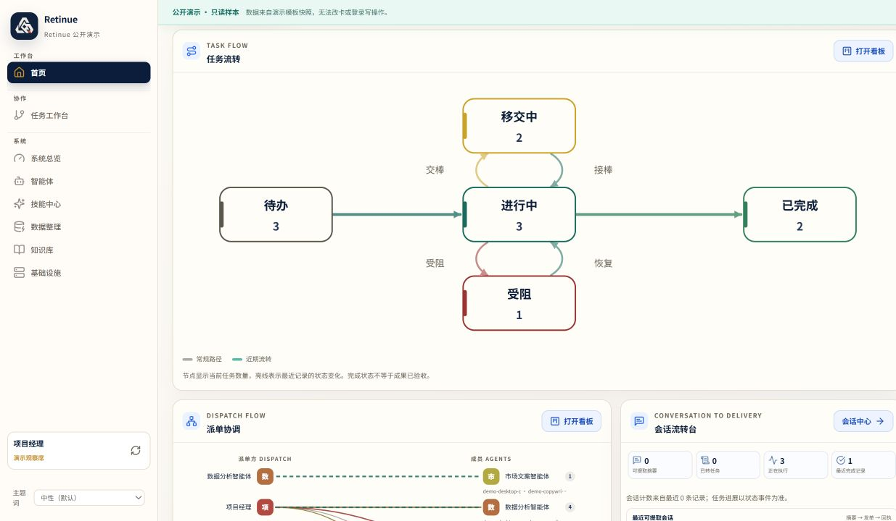
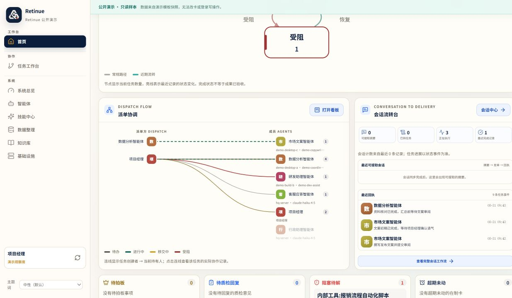
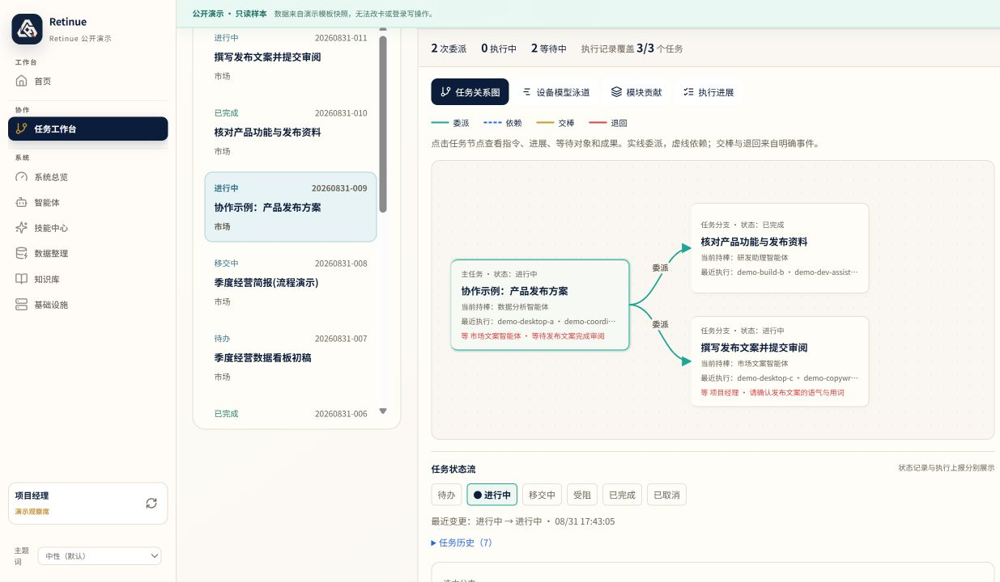
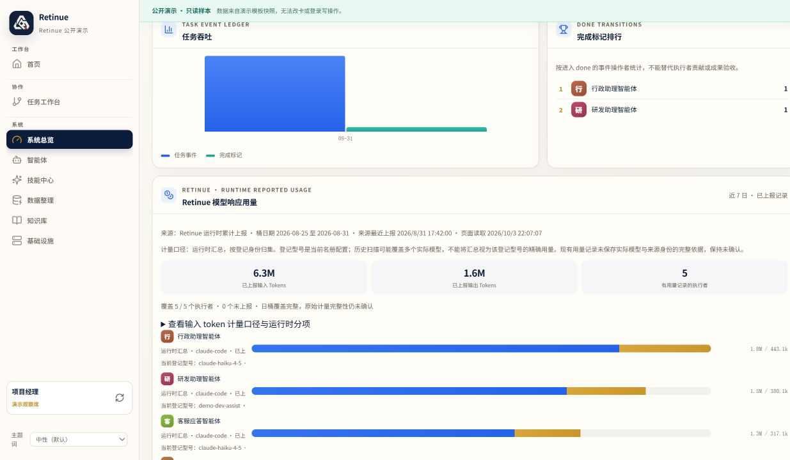
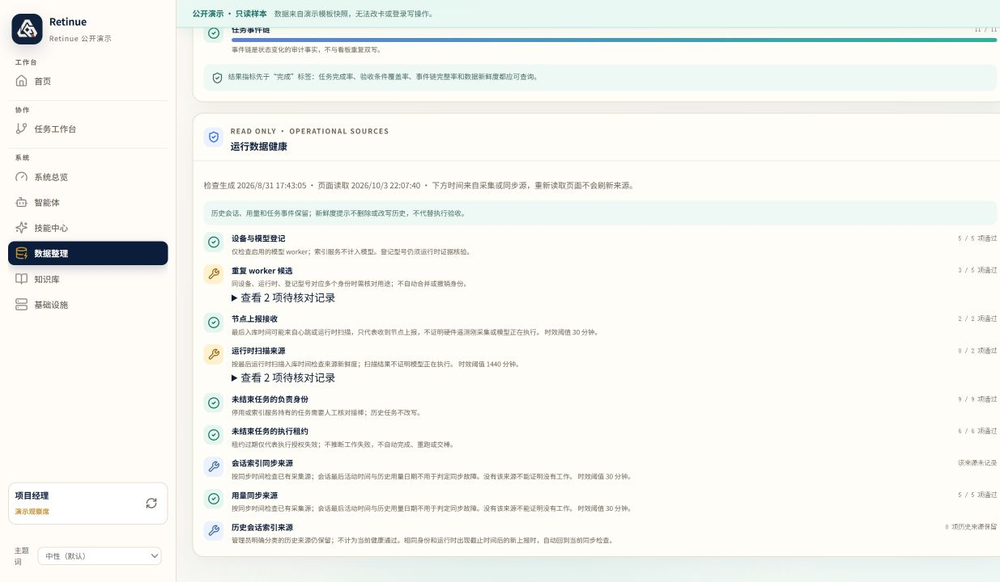
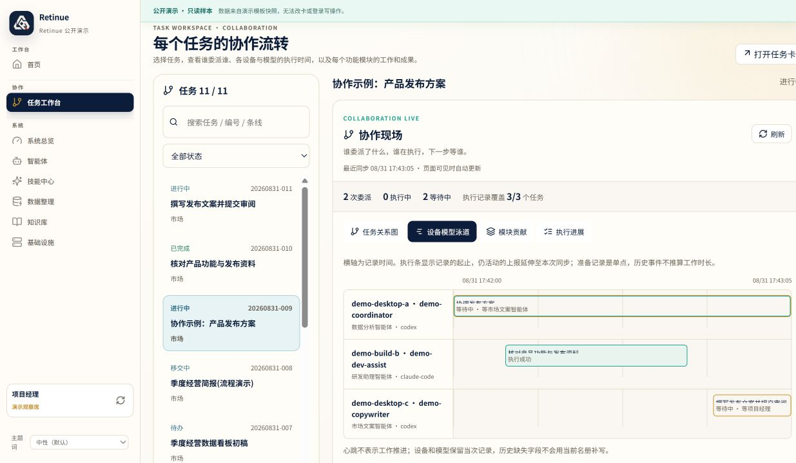
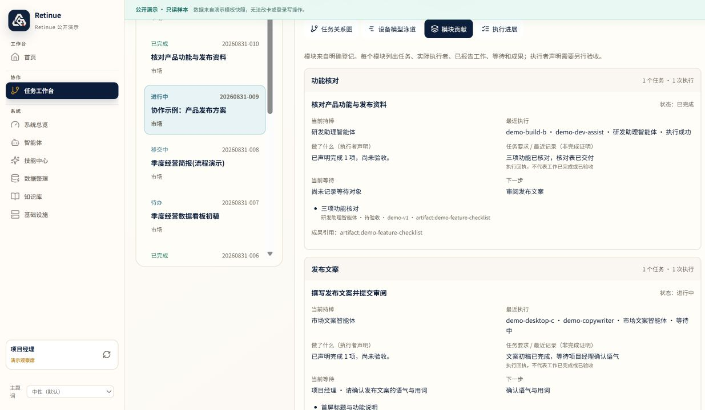
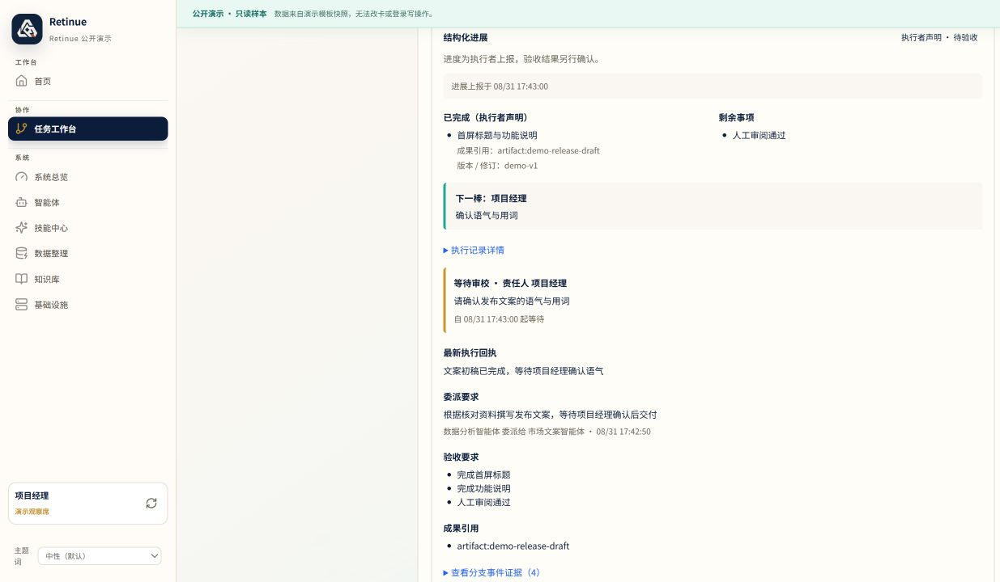
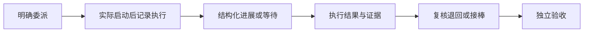

# 2026-10-02 社区更新：看清每个任务的多智能体协作

Retinue 把任务委派、设备与模型身份、执行进展、等待对象、退回和接棒放在同一个任务现场。本次更新保留首页可视化，补齐每任务协作视图，并让运营数字有明确的来源和范围。

软件版本沿用 `0.3.0a1`，这是一次社区更新，不是新的稳定版承诺。自有代码采用 MIT；第三方依赖和资产的许可声明保留。

## 可用于 GitHub 的简介

中文：

> Retinue 是异构 AI Worker 的本地协调与观察工具。通过任务关系图、设备/模型泳道和结构化回执，看清谁委派谁、进展如何、等待什么、怎样退回与接棒。支持只读 runtime 观察，并区分用量来源、覆盖和新鲜度。

English:

> Retinue is a local coordination and observability tool for heterogeneous AI workers. Task graphs, device/model timelines, and structured receipts make delegation, progress, waiting, review returns, and handoffs visible. Read-only runtime observers expose usage with explicit source, coverage, and freshness boundaries.

GitHub 仓库 Description 可用：

> Local coordination and observability for heterogeneous AI workers: task graphs, device/model timelines, structured receipts, and source-aware usage.

## 这次改变了什么

| 问题 | 现在的行为 |
|---|---|
| 首页看不到原有任务流转 | 保留任务流转、派单协调、会话流转台三项视图 |
| 多个模型忙碌，但同任务协作难追踪 | 每项任务有委派/依赖/交棒/退回关系图及设备/模型泳道 |
| 看不到各功能模块做了什么 | 显式模块分工关联工作声明、剩余项、负责人和成果引用 |
| 下一位 Worker 依赖聊天找上下文 | 只读任务 context 提供条件、状态记录、未核验声明和证据版本 |
| 模型、设备、会话和同步器混在一起 | Worker 身份明确到设备/runtime/模型；运输与观察服务单列 |
| cc-connect 有原生会话却缺少观察 | 只读匹配原生会话，并按实际消息模型分层采集 Claude 用量 |
| 多来源用量和过期数据被混读 | 分开任务事件、runtime 日报和会话累计，展示来源、覆盖、时区和回执时间 |
| 重复入口让导航难理解 | 统一运营效率入口，保留任务、会话和其他既有功能 |

## 界面预览

以下八张图片从只读公开演示直接截取。任务、身份、设备和用量均为**合成演示**，不代表真实业务记录或真实模型端到端验收。协作图片围绕同一项固定任务“协作示例：产品发布方案”；时间由固定种子演示时钟按阶段生成，用于展示先后和等待跨度，不代表生产活动时间。

### 首页：原有三项可视化继续保留

第一张展示任务流转图；补充截图展示首页下半部的派单协调与会话流转台，完整记录保留的三项可视化。

### 同任务协作：关系图、时间泳道与模块贡献

选中节点后可查看委派指令、验收条件、进展、等待对象和成果。历史没有执行回执时显示“尚无执行上报”，不会从旧聊天补画一次执行。

### 运营效率：数字带来源和覆盖

未上报显示未知；页面刷新与采集源刷新分别说明。缓存输入只计一次，任务完成标记和成果验收分开解释。

### 数据整理：过期与历史来源保持可见

基础结构完整度不等于运行来源新鲜；历史任务、会话与用量保留供复盘。

### 设备/模型时间泳道：看谁参与了哪一段

发布统筹、功能核对和发布文案分别占据自己的泳道。已交付与等待审阅保持不同状态；条带来自同一合成任务的服务记录及分阶段演示时间，不能作为模型真实运行时长的证明。

### 功能模块贡献：看每个模块做了什么

模块视图把显式标签对应的任务、执行身份、已报工作、剩余项和成果引用放在一起。没有独立复核的声明仍保留未核验标记；未标模块的历史记录不会按标题自动分配。

### 分支详情：展开指令、进展、等待与成果

点开同一任务的一条分支，就能从图里的节点进入具体证据：谁委派、要求做什么、已报哪些工作、正在等谁、下一步是什么。详情中的进展是执行者声明，成果引用仍需独立核验。

## 协作记录怎样产生

委派创建子任务，不等于启动模型；执行者上报完成工作，不等于成果已验收。服务端仍校验当前 holder、租约和幂等键。下一位 Worker 读取 context 获得工作说明，权限由合法接棒决定。

## 当前边界

- 原生会话观察不自动生成任务进度；需要显式任务关联和结构化回执。
- 模型登记与上报保留来源，不声称供应商认证。
- 用量合计覆盖已上报来源，不是完整账单，也不会自动按任务分摊。
- 私有转录不进入共享 context；引用的外部成果仍需独立核验。
- 公开静态演示验证交互与协议；真实模型闭环按独立验收清单检查。

下一阶段优先完成受控 runtime 接入和真实进度回执，再增加 GitHub 不可变证据核对。详见 [PRD](../PRD.md) 和 [协作协议](../protocol/collaboration.md)。

## 发布说明

本公开版本采用独立的脱敏快照。生产数据库、凭据、真实账号、部署地址、私人机器标识、工作目录和转录内容均不属于公开材料。截图不使用真实业务记录再遮盖的方式制作。

MIT 适用于本公开版本的自有代码；历史版本仍遵循各版本发布时的许可，历史标签不改写。请保留仓库中的第三方许可及版权声明。许可选择不替代依赖审计。
