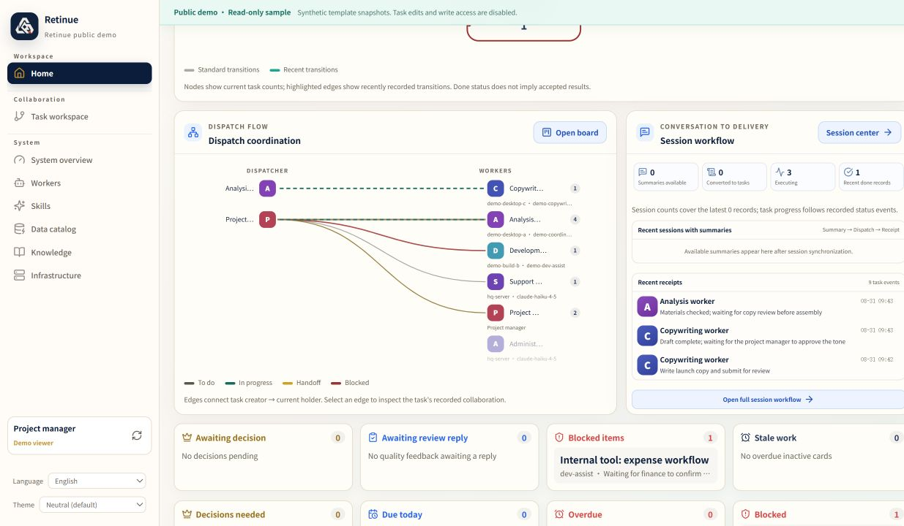
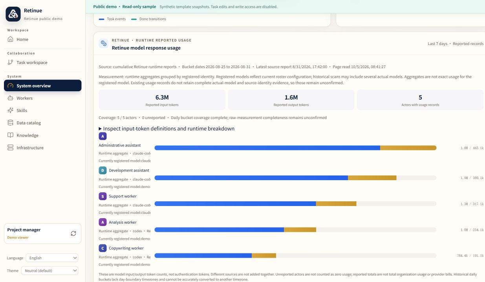
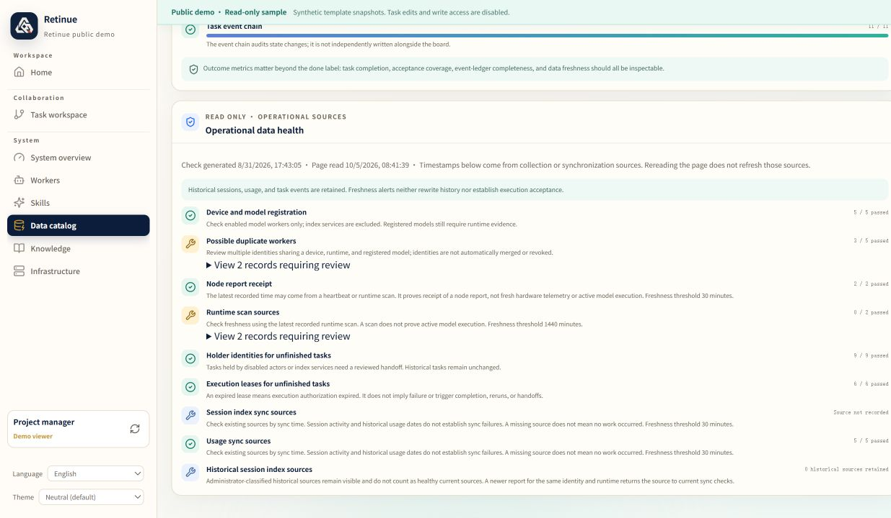
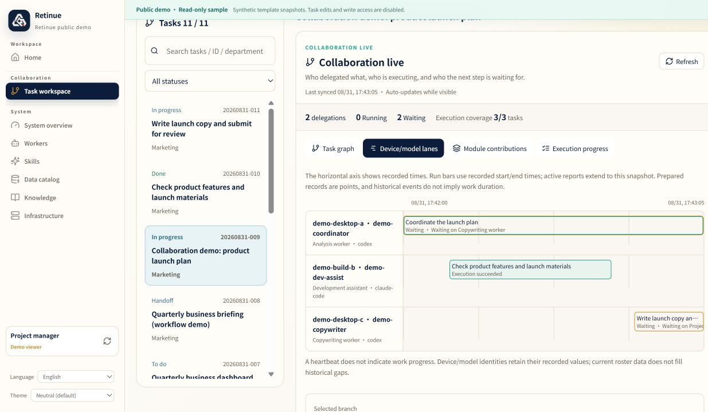
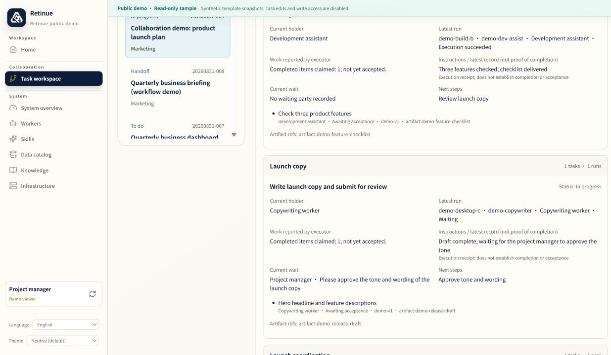
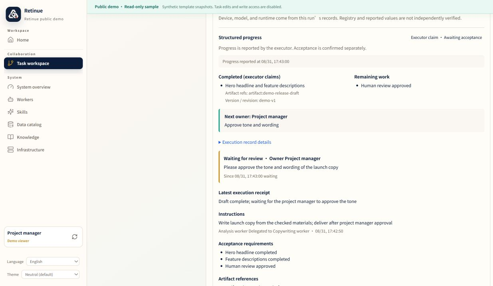
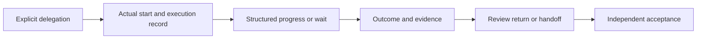

# English edition: visible collaboration in Retinue

**English** · [中文版本介绍](2026-10-02-collaboration-observability.md) · [English demo](https://jklthinking.github.io/retinue/demo-en/?lang=en) · [English PRD](../PRD.en.md)

The `0.3.0a1` community update now has a switchable English interface, an English product requirements document, and English screenshots. Chinese remains available. Retinue's own code is MIT licensed; third-party notices remain intact.

## What changed

| Area | English edition |
|---|---|
| Dashboard | Navigation, home visualizations, task workspace, graph, lanes, modules, details, operations, and supporting pages |
| Language switch | Select English or 简体中文 without losing the task/page deep link; preference is saved locally |
| Task content | Live user-entered titles, instructions, progress notes, references, and identities remain unchanged |
| Public demo | English synthetic fixtures for the same fixed product-launch scenario; no private deployment data |
| Documentation | English PRD, release introduction, sharing copy, and links from the Chinese editions |
| Screenshots | Direct captures of the functioning English demo, retained alongside the Chinese gallery |

Open the [English demo](https://jklthinking.github.io/retinue/demo-en/?lang=en). The language control also works in the regular dashboard. The URL parameter `lang=en` or `lang=zh-CN` takes precedence over the saved preference. Choosing a language changes interface copy, not authority, task state, or execution permissions.

## GitHub introduction

> Retinue is a self-hosted coordination and observability tool for heterogeneous AI workers. Per-task graphs, device/model lanes, module contributions, and structured receipts show who delegated to whom, what was reported, who is waiting, and what evidence supports the next handoff. Usage views explain source, coverage, and freshness. Chinese and English interfaces are available; Retinue's own code is MIT licensed.

## Screenshot gallery

All eight images below are direct captures of a read-only **synthetic demo**. Tasks, workers, devices, usage, and stage times are synthetic. The collaboration images follow the same fixed task, “Collaboration demo: product launch plan.” They demonstrate interface and protocol behavior, not real-model execution acceptance.

### Home: original visualizations retained




Task flow, dispatch coordination, and session flow remain available.

### Same-task collaboration


Select a task or execution node to inspect delegation, instructions, criteria, progress, wait owners, artifacts, and next steps. Historical tasks without execution receipts remain labelled as having no execution report.

### Operations



Task events, runtime daily reports, and optional cumulative session projections retain separate explanations. Missing reports remain unknown. Page refresh time is separate from source report time.

### Data quality



Structure checks, source freshness, identity completeness, and historical sources remain visible. Stale history is not deleted to make checks appear healthy.

### Worker lanes



Launch coordination, feature checks, and launch copy occupy separate lanes. Recorded execution and waiting remain distinct; deterministic demo stage times are not production runtime evidence.

### Module contributions



Explicit module labels connect responsible identities, reported work, remaining items, and artifact references. Unreviewed claims remain unverified; missing labels are not inferred from titles.

### Branch details



The copy branch shows its instruction, draft progress, project-manager wait, artifact reference, and next action. An artifact link does not itself establish independent acceptance.

## Behavior and limits



Delegation creates a child task; it does not launch a model. Worker reports do not establish acceptance. Holder, lease, and idempotency checks continue to govern writes. Context helps the next worker understand the task; legal handoff determines its authority.

- Native session observation does not automatically become task progress. Explicit binding and structured reporting remain necessary.
- Registered/reported models have provenance, rather than vendor-certified identity.
- Usage covers reporting sources; it is not a complete bill or automatic task-cost allocation.
- Private transcripts stay outside shared task context.
- Public static demonstrations and real-model acceptance are separate checks.

## Reproduce the demos

After installing the repository's documented Python and Node dependencies:

```bash
python scripts/build_static_demo.py --output docs/demo
python scripts/build_static_demo.py --output docs/demo-en --language en
```

Both builds use the fixed seed and isolated synthetic inputs. The English builder translates known fixture copy only. It does not read private sessions or rewrite server records. Each build includes its language and frozen observation time in `build.json`.

For consecutive builds with dependencies already installed by `npm ci --prefix webui`, add `--skip-install` to reuse that installation. This still runs TypeScript compilation, builds the UI, and refreshes the fixtures without changing the lockfile. Full tests and publication checks run separately.

See the [English PRD](../PRD.en.md), [collaboration protocol](../protocol/collaboration.md), and [English sharing draft](../sharing/english.md). The next priority remains controlled runtime integration, explicit task binding, and real structured progress receipts.
