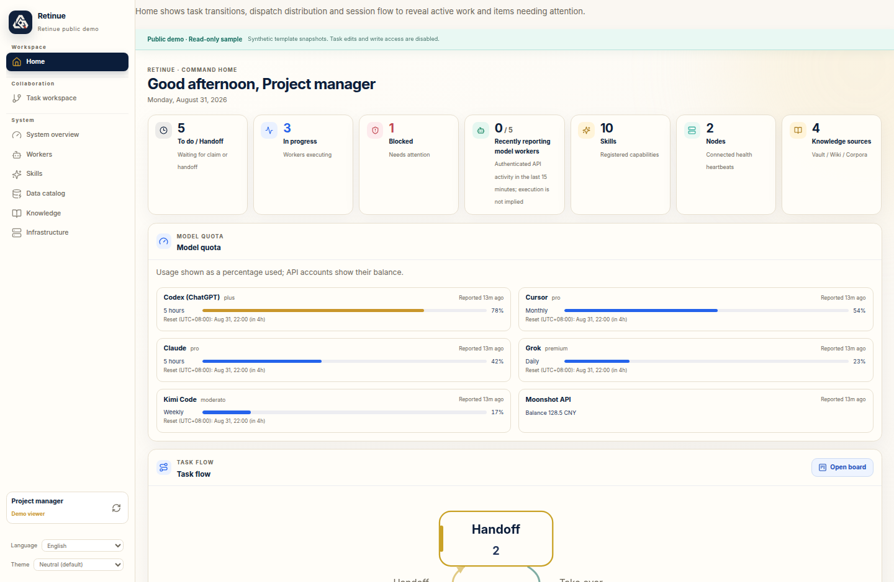

# Home model quota / 首页模型额度

The public dashboard now includes the node-reported quota feature in both
English and 简体中文. Claude, Codex, Grok, Cursor and Kimi subscription usage,
plus Moonshot API balance, can be collected after local opt-in. Cards show used
percentage, reset time and report age, and distinguish stale or failed queries
from fresh readings. Reset time passing alone never implies refilled quota.

This update adds schema 26 and authenticated quota read/report/history APIs.
Existing deployments require the explicit migration described in
[Self hosting](../../SELF_HOSTING.md#upgrade). No production credentials,
accounts or conversation records are included in this repository or its demos.

[Chinese mobile quota screenshot](../images/2026-10-07-quota/quota-mobile-zh.png)

Validation includes backend authorization/migration/retention tests, bilingual
UI and multiple-account/reset tests, the full repository gate and frontend
suite, plus browser checks at 1440, 1100, 390 and 375 pixels. Both demos render
six synthetic providers with no external requests, quota overflow or page errors.

- [English setup and semantics](../node-quota.en.md)
- [中文配置和接口说明](../node-quota.md)
- [English synthetic demo](../demo-en/index.html?lang=en)
- [中文示例演示](../demo/index.html?lang=zh-CN)
- [Conversation timeline proposal](../design/collaboration-conversations.md)

The conversation timeline is a design proposal. This release implements model
quota display; it does not add Claude live chat or automatically publish sessions.

首页新增「模型额度」，支持逐节点开启采集、中英切换、多个账号、过期提示及失败时
的上次成功数据。订阅额度展示已用比例，Moonshot API 展示余额。公开演示全部使用
示例数据。任务内的「沟通记录」已整理为设计提案，后续可复用现有会话归档，显示真实
发件人、收件人、问答和决策，并保留来源与可见范围。
