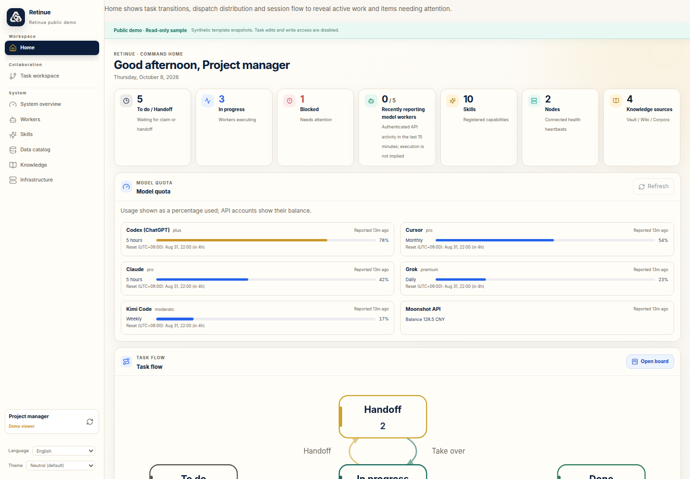

# Manual model quota refresh / 手动查询模型额度

Version `0.3.0a3` adds **Refresh** beside Home model quota. It requests a new
vendor query on each reporting node and tracks pending, querying, completion,
partial failure and timeout. Fresh correlated reports provide completion proof;
old snapshots never produce an “updated” message. Local consent stays on each
node. Re-enrollment preserves existing choices when no new choice is provided.

Schema 27 adds durable request/batch tables. Back up consistently with writers
stopped before migrating. Nodes opt into the new 30-second quota-poll timer;
older daily reporting remains compatible. See [setup](../node-quota.en.md) and
[中文配置](../node-quota.md) for roles, deadlines, rate limits and rollback.

Public demos use synthetic quota only and are read-only: their Refresh button is
disabled. Conversation timelines remain a separately staged feature.

[中文手机截图](../images/2026-10-08-quota-refresh/quota-refresh-mobile-zh.png)

本次更新在首页增加「刷新查询」，真正向节点发起新查询。等待、查询中、部分失败和
超时均有明确提示；没有本次新数据时保留上次数据。默认仅管理员可发起；额度凭证
不上传，节点只运行已同意的采集器。重新安装不再清空已有同意和代理配置。
